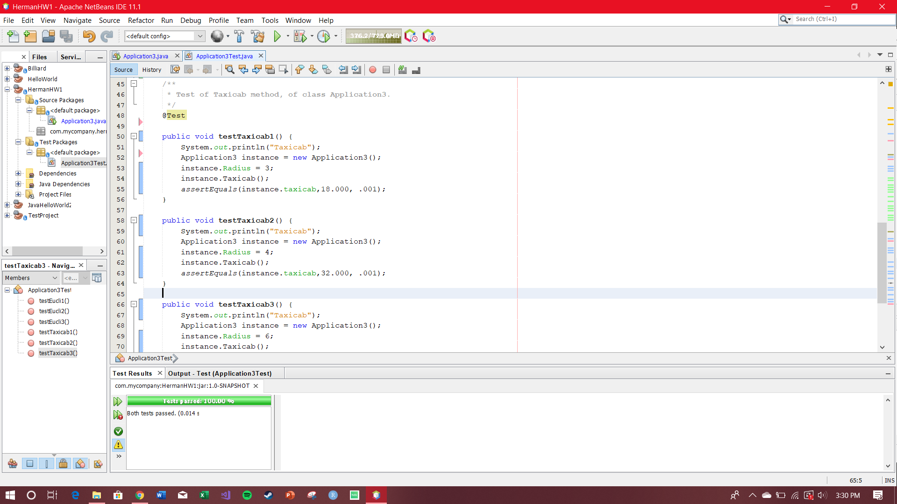

        
        
## Description
        Background: This assignment is focused on the difference of the areas of two circles with radius R. This program calculates the (Euclidian) geometry, and also, calculates the taxicab geometry.

        First, I created a public class named Application3. That contained methods such as Eucli() and Taxicab() that calculated the Area in both desired ways.
         I had a run() function that ran the methods and outputed the correct calculations.
        To check my work I created test cases for Eucli() and Taxicab(). That compared the calculation to the expected answer.  
       
        

